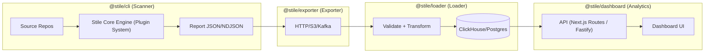

# 🧩 Stile - Design System Analytics & Adherence Platform

[](https://opensource.org/licenses/MIT)
[](https://nx.dev)
[](https://www.typescriptlang.org/)

**Stile** is an open-source analytics and adherence platform that helps organizations **measure**, **track**, and **improve** their design system adoption across engineering teams.

## 🚀 Quick Start

### Prerequisites

- Node.js ≥ 18
- Docker & Docker Compose
- Git

### Installation

1. **Clone the repository**
   ```bash
   git clone https://github.com/your-org/stile.git
   cd stile
   ```

2. **Install dependencies**
   ```bash
   npm install
   ```

3. **Start infrastructure**
   ```bash
   npm run docker:up
   ```

4. **Build all packages**
   ```bash
   npm run build
   ```

5. **Start the dashboard**
   ```bash
   npm run serve:dashboard
   ```

## 📦 Architecture

Stile consists of four main modules:



## 🛠️ Usage

### 1. Scanner CLI

Scan your codebase for design system adherence:

```bash
# Initialize Stile in your project
npx @stile/cli init

# Scan your codebase
npx @stile/cli scan --path ./src --output stile-report.json

# Validate configuration
npx @stile/cli validate
```

### 2. Exporter

Export scan results to various destinations:

```bash
# Export to HTTP endpoint
npx @stile/exporter push --config stile.exporter.config.js

# Export to S3
npx @stile/exporter push --config s3.config.js

# Export to Kafka
npx @stile/exporter push --config kafka.config.js
```

### 3. Loader

Load scan results into analytics databases:

```bash
# Start the loader API
npx @stile/loader serve --port 3001

# Create database schema
npx @stile/loader schema --config stile.loader.config.js
```

### 4. Dashboard

Access the analytics dashboard:

```bash
# Start the dashboard
npm run serve:dashboard

# Open http://localhost:3000
```

### Component Analysis Pipeline (ClickHouse + Grafana)

Run the full scanner → exporter → loader → dashboard loop using the bundled Material UI test app:

1. **Start infrastructure**
   ```bash
   npm run docker:up
   # Wait for ClickHouse and Grafana to finish booting
   ```

2. **Create analytics schema (one-time)**
   ```bash
   node packages/loader/bin/stile-loader.js schema --config stile.loader.config.js
   ```

3. **Start the loader API**
   ```bash
   node packages/loader/bin/stile-loader.js serve --config stile.loader.config.js --port 3001
   ```

4. **Run a component analysis scan against the demo app**
   ```bash
   npx stile scan \
     --config .test/material-ui-vite/stile.config.js \
     --path .test/material-ui-vite/src \
     --output .test/material-ui-vite/stile-report.json
   ```

5. **Export the report to the loader**
   ```bash
   node packages/exporter/bin/stile-exporter.js push \
     --config stile.exporter.config.js \
     --file .test/material-ui-vite/stile-report.json
   ```

6. **Explore the Grafana dashboard**
   - Sign in at [http://localhost:3000](http://localhost:3000) (admin / admin)
   - Open the *Stile Component Analysis* dashboard to review design-system vs. custom component trends

The Grafana provisioning files under `infra/grafana` automatically register the ClickHouse datasource and pre-built dashboard so the metrics are ready as soon as data is ingested.

## 📊 Features

### Scanner Engine
- **Plugin-based architecture** - Extensible rule system
- **Framework agnostic** - Works with React, Vue, Angular, etc.
- **Fast scanning** - Optimized for large codebases
- **Custom rules** - Write your own adherence rules

### Analytics Dashboard
- **Adherence metrics** - Track design system adoption
- **Violation trends** - Monitor rule violations over time
- **Project health** - Compare adherence across projects
- **Team insights** - Identify areas for improvement

### Data Pipeline
- **Multiple export formats** - HTTP, S3, Kafka
- **Database support** - ClickHouse, PostgreSQL
- **Real-time processing** - Stream processing capabilities
- **Data validation** - Schema validation and deduplication

## 🔧 Configuration

### Scanner Configuration (`stile.config.js`)

```javascript
export default {
  rootDir: "./src",
  rules: [
    {
      test: /\.(t|j)sx?$/,
      plugins: [
        "@stile/plugin-no-inline-style",
        "@stile/plugin-ds-usage",
        "@stile/plugin-react-component-analysis"
      ]
    }
  ],
  output: {
    format: "json"
  },
  exclude: [
    "node_modules/**",
    "dist/**",
    "build/**"
  ]
};
```

### Exporter Configuration (`stile.exporter.config.js`)

```javascript
export default {
  type: "http",
  endpoint: "http://localhost:3001",
  batchSize: 100,
  retries: 3,
  timeout: 30000,
  auth: {
    type: "api-key",
    value: "your-api-key-here"
  }
};
```

### Loader Configuration (`stile.loader.config.js`)

```javascript
export default {
  database: {
    type: "clickhouse",
    host: "localhost",
    port: 8123,
    database: "stile",
    username: "stile",
    password: "stile123"
  },
  batchSize: 1000,
  retries: 3
};
```

## 🧩 Default Plugins

Stile comes with several built-in plugins:

- **`@stile/plugin-no-inline-style`** - Detects inline styles
- **`@stile/plugin-ds-usage`** - Tracks design system usage
- **`@stile/plugin-unused-components`** - Finds unused components
- **`@stile/plugin-inconsistent-spacing`** - Detects spacing issues
- **`@stile/plugin-accessibility`** - Checks accessibility compliance

## 🚀 Development

### Project Structure

```
stile/
├── packages/
│   ├── cli/                 # Scanner CLI
│   ├── core/                # Engine & resolver
│   ├── exporter/            # Export module
│   ├── loader/              # DB ingestion
│   ├── dashboard/           # Next.js dashboard
│   ├── rules/               # Default rule plugins
│   └── types/               # Shared TS types
├── infra/
│   ├── clickhouse/
│   ├── kafka/
│   └── grafana/
└── docs/
    └── technical-requirements.md
```

### Available Scripts

```bash
# Build all packages
npm run build

# Run tests
npm run test

# Lint code
npm run lint

# Type check
npm run typecheck

# Start infrastructure
npm run docker:up

# Stop infrastructure
npm run docker:down

# Start dashboard
npm run serve:dashboard
```

### Adding New Plugins

1. Create a new plugin in `packages/rules/src/`
2. Implement the `Plugin` interface
3. Export the plugin from `packages/rules/src/index.ts`
4. Use the plugin in your configuration

## 📈 Roadmap

- [ ] **Phase 1** - Scanner Core + CLI (2-3 weeks)
- [ ] **Phase 2** - Exporter (1-2 weeks)
- [ ] **Phase 3** - Loader + DB schema (2-3 weeks)
- [ ] **Phase 4** - Analytics Dashboard (3-4 weeks)
- [ ] **Phase 5** - Runtime SDK (optional)

## 🤝 Contributing

We welcome contributions! Please see our [Contributing Guide](CONTRIBUTING.md) for details.

### Development Setup

1. Fork the repository
2. Create a feature branch
3. Make your changes
4. Add tests
5. Submit a pull request

## 📄 License

This project is licensed under the MIT License - see the [LICENSE](LICENSE) file for details.

## 🙏 Acknowledgments

- [Nx](https://nx.dev) for the monorepo tooling
- [TypeScript](https://www.typescriptlang.org/) for type safety
- [Next.js](https://nextjs.org/) for the dashboard
- [ClickHouse](https://clickhouse.com/) for analytics storage

## 📞 Support

- 📧 Email: support@stile.dev
- 🐛 Issues: [GitHub Issues](https://github.com/your-org/stile/issues)
- 📖 Documentation: [docs.stile.dev](https://docs.stile.dev)

---

**Made with ❤️ by the Stile team**
