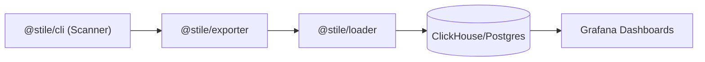
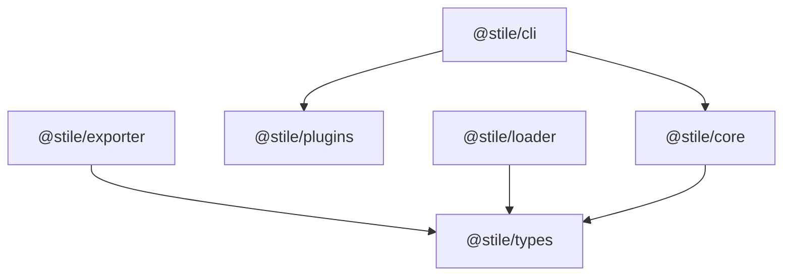
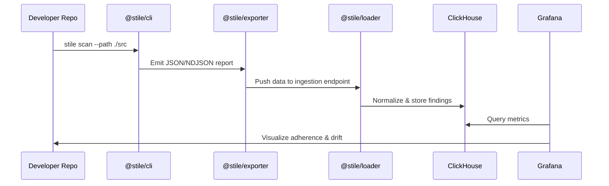

# 🧩 Stile Technical Requirement Document (TRD)

**Project:** Stile – Design System Analytics & Adherence Platform  
**Author:** Satyam Yadav  
**Date:** October 2025  
**Version:** 1.2  

---

## 1. Overview

**Stile** is an open-source analytics and adherence platform that helps organizations **measure**, **track**, and **improve** their design system adoption across engineering teams.

It consists of modular components:  
1. **Scanner CLI** – Scans codebases using a Webpack-like plugin system.  
2. **Exporter** – Sends scan results to ingestion pipelines.  
3. **Loader** – Normalizes and loads data into analytics databases.  
4. **Grafana Integration** – Visualizes design system adherence, adoption, and drift metrics.

---

## 2. Goals

### Primary Objectives
- Quantify design-system adoption and adherence.  
- Build a **plugin-based scanner** architecture similar to Webpack.  
- Enable a scalable ELTP (Extract–Load–Transform–Publish) pipeline.  
- Integrate with Grafana for analytics instead of building a custom dashboard.

### Non-Goals
- Replace existing linters (ESLint, Stylelint).  
- Ship UI component libraries.  
- Lock users to a specific DB or visualization tool.

---

## 3. High-Level Architecture



---

## 4. Monorepo Setup (Nx)

### Initialize Workspace
```bash
npx create-nx-workspace@latest stile
cd stile
npm install -D typescript eslint prettier
```

### Create Packages
```bash
nx g @nx/node:library core --directory=packages --unitTestRunner=jest
nx g @nx/node:application cli --directory=packages
nx g @nx/node:library exporter --directory=packages
nx g @nx/node:library loader --directory=packages
nx g @nx/node:library plugins --directory=packages
nx g @nx/node:library types --directory=packages
```

### Directory Layout
```
stile/
├── packages/
│   ├── cli/               # Scanner CLI (@stile/cli)
│   ├── core/              # Plugin runner and resolver
│   ├── exporter/          # Report exporter
│   ├── loader/            # Data ingestion service
│   ├── plugins/           # Default plugin set
│   ├── eltp/              # Optional orchestrator CLI
│   └── types/             # Shared interfaces
└── infra/
    ├── clickhouse/        # Schema + Docker setup
    ├── grafana/           # Predefined dashboards
    └── kafka/             # Optional ingestion queue
```

### Package Dependencies



---

## 5. Plugin Architecture

### Plugin Interface
```ts
export interface StilePlugin {
  name: string;
  test?: RegExp;
  run: (context: StileContext) => Promise<void> | void;
}
```

### Example Plugin
```ts
import { StilePlugin } from "@stile/core";
import { parse } from "@babel/parser";
import traverse from "@babel/traverse";

export const noInlineStylePlugin: StilePlugin = {
  name: "no-inline-style",
  test: /\.tsx?$/,
  run(ctx) {
    const ast = parse(ctx.source, { sourceType: "module", plugins: ["jsx", "typescript"] });
    traverse(ast, {
      JSXAttribute(path) {
        if (path.node.name.name === "style") {
          ctx.findings.push({
            plugin: "no-inline-style",
            message: "Avoid inline styles; use tokens or className.",
            severity: "warn",
            file: ctx.filePath,
          });
        }
      },
    });
  },
};
```

---

## 6. Data Flow



---

## 7. Exporter vs Loader

| Aspect | **Exporter** | **Loader** |
|--------|---------------|-------------|
| **Purpose** | Move data from the scanner to a reliable destination | Ingest, validate, and store data into analytics DB |
| **Runs where** | Near the scanner or CI/CD pipelines | Near the database or in backend infra |
| **Responsibility** | Packaging, transport (HTTP, Kafka, file) | Validation, normalization, deduplication |
| **Output** | File, HTTP payload, or Kafka stream | ClickHouse/Postgres inserts |
| **Failure handling** | Retry and buffering | Schema enforcement and deduplication |
| **Analogy** | Fluent Bit (log forwarder) | Elasticsearch (log store) |

---

## 8. Grafana Integration

- Uses ClickHouse as the primary data source.  
- Predefined dashboards for adherence, usage, violations, and token drift.  
- Supports alerting via Grafana.

**Example Query:**
```sql
SELECT
  plugin,
  count() AS violations,
  uniq(file) AS affected_files
FROM ds_findings
WHERE timestamp > now() - INTERVAL 30 DAY
GROUP BY plugin
ORDER BY violations DESC;
```

---

## 9. Development Roadmap

| Phase | Duration | Deliverables |
|--------|-----------|--------------|
| **Phase 1** | 2–3 weeks | Core Scanner + Plugin API |
| **Phase 2** | 1–2 weeks | Exporter module |
| **Phase 3** | 2–3 weeks | Loader + DB schema |
| **Phase 4** | 2 weeks | Grafana dashboards + infra |
| **Phase 5** | Later | SDK / runtime telemetry |

---

## 10. Tech Stack Summary

| Layer | Technology |
|--------|-------------|
| CLI/Core | Node.js, TypeScript, TS-Morph |
| Exporter | Node.js, Axios, Kafka client |
| Loader | Fastify, Zod, ClickHouse |
| Analytics | Grafana Dashboards |
| Infra | Docker Compose (ClickHouse + Grafana) |
| Orchestration | Nx Workspace |

---
