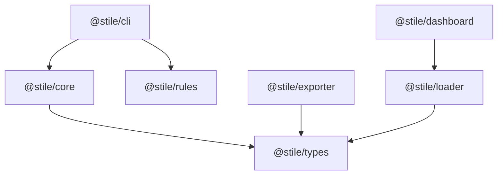
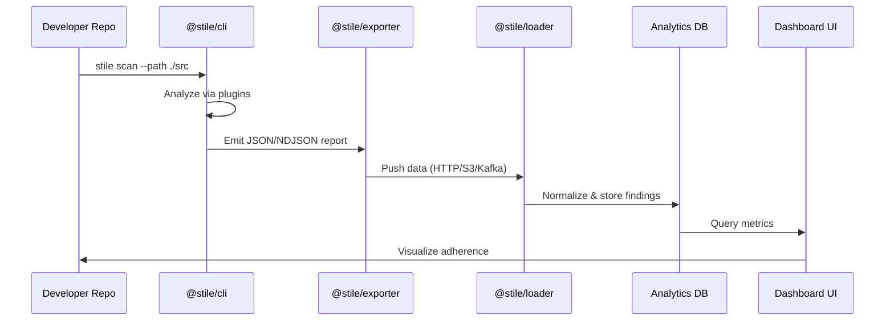

# 🧩 Stile Technical Requirement Document (TRD)

**Project:** Stile – Design System Analytics & Adherence Platform  
**Author:** Satyam Yadav  
**Date:** October 2025  
**Version:** 1.1  

---

## 1. Overview

**Stile** is an open-source analytics and adherence platform that helps organizations **measure**, **track**, and **improve** their design system adoption across engineering teams.

It consists of four main modules:
1. **Scanner CLI** – Scans codebases using a Webpack-like plugin system.  
2. **Exporter** – Sends scan results to ingestion endpoints or data stores.  
3. **Loader** – Transforms and loads data into analytics databases.  
4. **Analytics** – Visualizes design-system health, adoption, and adherence.

---

## 2. Goals

### Primary Objectives
- Quantify design-system adoption and adherence.
- Support a plugin-based scanning engine.
- Provide a complete pipeline from scan → storage → insights.
- Allow both self-hosted and enterprise deployments.

### Non-Goals
- Replacing linters (ESLint, Stylelint).  
- Providing UI component libraries.  
- Forcing specific DS frameworks (Stile is framework-agnostic).

---

## 3. High-Level Architecture

```mermaid
flowchart LR
    subgraph SCANNER["@stile/cli (Scanner)"]
        SRC["Source Repos"] --> CORE["Stile Core Engine (Plugin System)"]
        CORE --> REPORT["Report JSON/NDJSON"]
    end

    subgraph EXPORTER["@stile/exporter (Exporter)"]
        REPORT --> HTTP["HTTP/S3/Kafka"]
    end

    subgraph LOADER["@stile/loader (Loader)"]
        HTTP --> VALIDATE["Validate + Transform"]
        VALIDATE --> CH[(ClickHouse/Postgres)]
    end

    subgraph DASHBOARD["@stile/dashboard (Analytics)"]
        CH --> API["API (Next.js Routes / Fastify)"]
        API --> UI["Dashboard UI"]
    end
````

---

## 4. Monorepo Setup (Nx)

### Initialize Workspace

```bash
npx create-nx-workspace@latest stile
cd stile
npm install -D typescript eslint prettier
```

### Create Packages

```bash
nx g @nx/node:library core --directory=packages --unitTestRunner=jest
nx g @nx/node:application cli --directory=packages
nx g @nx/node:library exporter --directory=packages
nx g @nx/node:library loader --directory=packages
nx g @nx/next:app dashboard --directory=packages
```

### Directory Layout

```
stile/
├── apps/
│   └── dashboard/           # Next.js dashboard
├── packages/
│   ├── cli/                 # Scanner CLI
│   ├── core/                # Engine & resolver
│   ├── exporter/            # Export module
│   ├── loader/              # DB ingestion
│   ├── rules/               # Default rule plugins
│   └── types/               # Shared TS types
├── infra/
│   ├── clickhouse/
│   ├── kafka/
│   └── grafana/
└── docs/
    └── technical-requirements.md
```

### Inter-package Dependencies



---

## 5. Core Components

### 5.1 Scanner CLI (`@stile/cli`)

* Scans source files.
* Executes plugin chains similar to Webpack loaders.
* Produces JSON or NDJSON report.

Example:

```bash
npx @stile/cli scan --path ./apps/web --out stile-report.json
```

**Sample Config**

```js
export default {
  rootDir: "./src",
  rules: [
    {
      test: /\.(t|j)sx?$/,
      use: ["@stile/plugin-no-inline-style", "@stile/plugin-ds-usage"]
    }
  ]
};
```

---

### 5.2 Exporter (`@stile/exporter`)

* Reads CLI output and forwards it to HTTP, S3, or Kafka.
* Supports batching, retries, filters, and anonymization.

Example:

```bash
npx @stile/exporter push --config stile.exporter.config.js
```

---

### 5.3 Loader (`@stile/loader`)

* Ingests exported data into analytics databases.
* Validates schema, deduplicates, and normalizes.

```sql
CREATE TABLE ds_findings (
  project String,
  rule String,
  file String,
  message String,
  severity String,
  timestamp DateTime
) ENGINE = MergeTree() ORDER BY (project, rule, timestamp);
```

---

### 5.4 Analytics Dashboard (`@stile/dashboard`)

* Next.js + shadcn/ui interface.
* Reads from ClickHouse and Postgres.
* Displays adherence, drift, and adoption metrics.

```bash
nx serve dashboard
```

Views include:

* **Adherence Overview**
* **Component Usage**
* **Rule Violations**
* **Team Health Trends**

---

## 6. Data Contracts

```ts
export interface Finding {
  project: string;
  rule: string;
  file: string;
  message: string;
  severity: "info" | "warn" | "error";
  line?: number;
  column?: number;
  commit?: string;
  timestamp: string;
}

export interface ScanReport {
  meta: { project: string; commit: string; timestamp: string };
  findings: Finding[];
  summary: { filesScanned: number; violations: number; adherenceScore: number };
}
```

---

## 7. Data Flow Diagram



---

## 8. Development Roadmap

| Phase       | Duration  | Deliverables           |
| ----------- | --------- | ---------------------- |
| **Phase 1** | 2–3 weeks | Scanner Core + CLI     |
| **Phase 2** | 1–2 weeks | Exporter               |
| **Phase 3** | 2–3 weeks | Loader + DB schema     |
| **Phase 4** | 3–4 weeks | Analytics Dashboard    |
| **Phase 5** | Later     | Runtime SDK (optional) |

---

## 9. Non-Functional Requirements

| Category          | Target                            |
| ----------------- | --------------------------------- |
| **Performance**   | Scan 5k files < 30s               |
| **Extensibility** | Custom rule plugins (npm)         |
| **Security**      | API key auth for exporter         |
| **Reliability**   | Retry + checkpointing in exporter |
| **Portability**   | Node.js ≥18, Nx monorepo          |
| **Observability** | CLI logs + metrics dashboards     |

---

## 10. Tech Stack Summary

| Layer         | Technology                                  |
| ------------- | ------------------------------------------- |
| CLI/Core      | Node.js, TypeScript, TS-Morph               |
| Exporter      | Node.js, Axios, Kafka client                |
| Loader        | Fastify, Zod, ClickHouse                    |
| Dashboard     | Next.js (App Router), shadcn/ui, Recharts   |
| Infra         | Docker Compose (ClickHouse, Grafana, Kafka) |
| Orchestration | Nx Workspace                                |

---

## 11. Future Enhancements

* VS Code plugin for inline rule feedback
* Figma API integration for design-code drift
* LLM-based adherence insights
* Plugin marketplace
* Cloud ingestion service (Stile Cloud)

---
