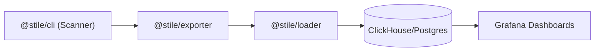
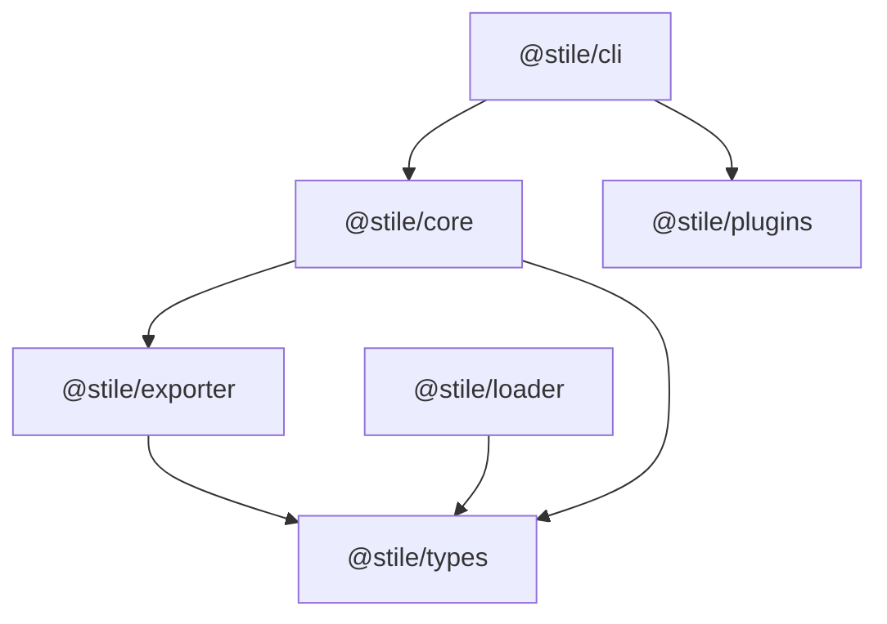
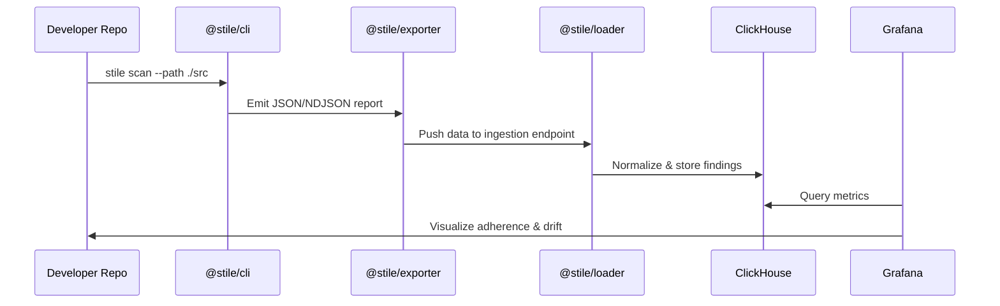

# 🧩 Stile Technical Requirement Document (TRD)

**Project:** Stile – Design System Analytics & Adherence Platform  
**Author:** Satyam Yadav  
**Date:** October 2025  
**Version:** 1.2  

---

## 1. Overview

**Stile** is an open-source analytics and adherence platform that helps organizations **measure**, **track**, and **improve** their design system adoption across engineering teams.

It consists of modular components:  
1. **Scanner CLI** – Scans codebases using a Webpack-like plugin system.  
2. **Exporter** – Sends scan results to ingestion pipelines.  
3. **Loader** – Normalizes and loads data into analytics databases.  
4. **Grafana Integration** – Visualizes design system adherence, adoption, and drift metrics.

---

## 2. Goals

### Primary Objectives
- Quantify design-system adoption and adherence.  
- Build a **plugin-based scanner** architecture similar to Webpack.  
- Enable a scalable ELTP (Extract–Load–Transform–Publish) pipeline.  
- Integrate with Grafana for analytics instead of building a custom dashboard.

### Non-Goals
- Replace existing linters (ESLint, Stylelint).  
- Ship UI component libraries.  
- Lock users to a specific DB or visualization tool.

---

## 3. High-Level Architecture



---

## 4. Monorepo Setup (Nx)

### Initialize Workspace
```bash
npx create-nx-workspace@latest stile
cd stile
npm install -D typescript eslint prettier
```

### Create Packages
```bash
nx g @nx/node:library core --directory=packages --unitTestRunner=jest
nx g @nx/node:application cli --directory=packages
nx g @nx/node:library exporter --directory=packages
nx g @nx/node:library loader --directory=packages
nx g @nx/node:library plugins --directory=packages
nx g @nx/node:library types --directory=packages
```

### Directory Layout
```
stile/
├── packages/
│   ├── cli/               # Scanner CLI (@stile/cli)
│   ├── core/              # Plugin runner and resolver
│   ├── exporter/          # Report exporter
│   ├── loader/            # Data ingestion service
│   ├── plugins/           # Default plugin set
│   ├── examples/          # Example project for E2E tests
│   └── types/             # Shared interfaces
└── infra/
    ├── clickhouse/        # Schema + Docker setup
    ├── grafana/           # Predefined dashboards
    └── postgres/          # PostgreSQL setup
```

### Package Dependencies



---

## 5. Plugin Architecture

### Plugin Interface
```typescript
export interface StilePlugin {
  name: string;
  version?: string;
  description?: string;
  author?: string;
  test?: RegExp;
  run: (context: StileContext, options?: Record<string, any>) => void | Promise<void>;
}
```

### Example Plugin
```typescript
import { StilePlugin } from "@stile/core";
import { parse } from "@babel/parser";
import traverse from "@babel/traverse";

export const noInlineStylePlugin: StilePlugin = {
  name: "@stile/plugin-no-inline-style",
  test: /\.tsx?$/,
  run(ctx) {
    const ast = parse(ctx.source, { sourceType: "module", plugins: ["jsx", "typescript"] });
    traverse(ast, {
      JSXAttribute(path) {
        if (path.node.name.name === "style") {
          ctx.findings.push({
            plugin: "no-inline-style",
            message: "Avoid inline styles; use tokens or className.",
            severity: "warn",
            file: ctx.filePath,
          });
        }
      },
    });
  },
};
```

---

## 6. Data Flow



---

## 7. Exporter vs Loader

| Aspect | **Exporter** | **Loader** |
|--------|---------------|-------------|
| **Purpose** | Move data from the scanner to a reliable destination | Ingest, validate, and store data into analytics DB |
| **Runs where** | Near the scanner or CI/CD pipelines | Near the database or in backend infra |
| **Responsibility** | Packaging, transport (HTTP, Kafka, file) | Validation, normalization, deduplication |
| **Output** | File, HTTP payload, or Kafka stream | ClickHouse/Postgres inserts |
| **Failure handling** | Retry and buffering | Schema enforcement and deduplication |
| **Analogy** | Fluent Bit (log forwarder) | Elasticsearch (log store) |

---

## 8. Grafana Integration

- Uses ClickHouse as the primary data source.  
- Predefined dashboards for adherence, usage, violations, and token drift.  
- Supports alerting via Grafana.

**Example Query:**
```sql
SELECT
  plugin,
  count() AS violations,
  uniq(file) AS affected_files
FROM ds_findings
WHERE timestamp > now() - INTERVAL 30 DAY
GROUP BY plugin
ORDER BY violations DESC;
```

---

## 9. Development Roadmap

| Phase | Duration | Deliverables |
|--------|-----------|--------------|
| **Phase 1** | 2–3 weeks | Core Scanner + Plugin API ✅ |
| **Phase 2** | 1–2 weeks | Exporter module |
| **Phase 3** | 2–3 weeks | Loader + DB schema |
| **Phase 4** | 2 weeks | Grafana dashboards + infra |
| **Phase 5** | Later | SDK / runtime telemetry |

---

## 10. Tech Stack Summary

| Layer | Technology |
|--------|-------------|
| CLI/Core | Node.js, TypeScript, TS-Morph |
| Exporter | Node.js, Axios, Kafka client |
| Loader | Fastify, Zod, ClickHouse |
| Analytics | Grafana Dashboards |
| Infra | Docker Compose (ClickHouse + Grafana) |
| Orchestration | Nx Workspace |
| Testing | Jest, Nx Jest Plugin |

---

## 11. Architecture Review & Implementation Plan

### 11.1 Architecture Decisions

**Terminology Decision: "Plugins" (not "Loaders")**

After reviewing the codebase and Webpack's architecture, we've decided to use **"plugins"** as the terminology for the scanner rules. This aligns with:
- The existing codebase implementation (`@stile/plugins`, `StilePlugin` interface)
- Clear separation from "loaders" which already refers to the data ingestion service (`@stile/loader`)
- Webpack's distinction: loaders transform files, plugins tap into the compilation process

**Architecture Layers:**
1. **Stile Core** (`@stile/core`) - Main engine that orchestrates plugins and manages the scanning pipeline
2. **Stile CLI** (`@stile/cli`) - Command-line interface that uses Core to execute scans
3. **Plugins** (`@stile/plugins` or independent packages) - Rule implementations that analyze code
4. **Exporter** (`@stile/exporter`) - Handles output routing to various destinations (HTTP, S3, Kafka, file)
5. **Loader** (`@stile/loader`) - Data ingestion service that validates and stores reports in databases

### 11.2 Open Questions - Resolved

**Q1: Should each plugin respond to an independent metric, or can multiple plugins provide data for similar metrics?**

**Answer:** Multiple plugins CAN provide data for similar metrics. This is by design:
- Different plugins may detect different aspects of the same issue (e.g., one plugin finds inline styles, another finds hardcoded colors)
- Plugins can contribute to the same metric category (e.g., "adherence", "accessibility", "performance")
- The Core engine aggregates all findings into a unified report
- This allows for modular, composable rule sets

**Q2: How should the report be exported?**

**Answer:** Separate exporters (not plugins) handle export logic. The architecture follows this flow:
1. **Plugins** → Analyze code and populate findings/components in the context
2. **Core** → Aggregates all plugin outputs into a unified `ScanReport`
3. **Exporter** → Routes the report to configured destinations (HTTP, S3, Kafka, or file)
4. **Loader** → (Optional) Ingests exported reports into analytics databases

This separation provides:
- Clear separation of concerns (scanning vs. exporting vs. loading)
- Multiple export destinations can be configured
- Exporters can be run independently (e.g., in CI/CD pipelines)
- Loaders can be deployed as separate services

### 11.3 Plugin Input and Output Specification

Plugins are the core analysis units in Stile. They receive a context object containing file information and write their findings back to that context.

#### Plugin Input (`StileContext`)

Each plugin receives a `StileContext` object containing:

```typescript
interface StileContext {
  filePath: string;        // Absolute path to the file being analyzed
  project: string;          // Project root directory
  source: string;            // Full source code content of the file
  findings: Finding[];      // Mutable array - plugin adds findings here
  components: ComponentInsight[];  // Mutable array - plugin adds component insights here
  commit?: string;          // Git commit hash (if available)
}
```

**Input Details:**
- **`filePath`**: Absolute file path - plugins can use this to determine file location, extension, or directory structure
- **`project`**: Root directory of the project being scanned - useful for relative path calculations
- **`source`**: Complete file content as a string - plugins parse/analyze this content
- **`findings`**: Mutable array reference - plugins push `Finding` objects to report violations/issues
- **`components`**: Mutable array reference - plugins push `ComponentInsight` objects to report component usage
- **`commit`**: Optional Git commit hash - provided by Core if Git is available

#### Plugin Output

Plugins produce output by mutating the context arrays:

**1. Findings (`Finding[]`)**

Plugins add violation findings to `context.findings`:

```typescript
interface Finding {
  plugin: string;           // Plugin name (auto-set by Core)
  message: string;           // Human-readable description of the issue
  severity: "info" | "warn" | "error";  // Severity level
  file: string;             // File path (auto-set by Core)
  project: string;           // Project root (auto-set by Core)
  timestamp: string;         // ISO timestamp (auto-set by Core)
  line?: number;            // Optional: line number where issue occurs
  column?: number;          // Optional: column number
  commit?: string;          // Optional: Git commit hash
  metadata?: Record<string, any>;  // Optional: additional structured data
}
```

**2. Component Insights (`ComponentInsight[]`)**

Plugins add component usage data to `context.components`:

```typescript
interface ComponentInsight {
  project: string;          // Project root (auto-set by Core)
  file: string;             // File path (auto-set by Core)
  component: string;        // Component name (e.g., "Button", "Card")
  source: string;           // Import source (e.g., "@mui/material", "./Button")
  category: "design-system" | "custom" | "third-party";  // Component category
  occurrences: number;      // Number of times component is used in file
  props: string[];          // Array of props used (e.g., ["variant", "color"])
  commit?: string;          // Optional: Git commit hash
  framework?: "react" | "vue" | "angular" | "svelte";  // Optional: framework
}
```

#### Plugin Execution Flow

```typescript
interface StilePlugin {
  name: string;             // Unique plugin identifier
  version?: string;         // Optional: plugin version
  description?: string;    // Optional: plugin description
  author?: string;         // Optional: plugin author
  test?: RegExp;            // Optional: file pattern matcher (e.g., /\.tsx?$/)
  run: (
    context: StileContext,  // Input: file context
    options?: Record<string, any>  // Optional: plugin-specific configuration
  ) => void | Promise<void>;  // Output: mutates context.findings and context.components
}
```

**Execution Steps:**
1. Core engine matches file against plugin's `test` pattern (if provided)
2. Core creates a fresh `StileContext` for the file
3. Core calls `plugin.run(context, options)` for each matching plugin
4. Plugin analyzes `context.source` and file metadata
5. Plugin pushes `Finding` objects to `context.findings` array
6. Plugin pushes `ComponentInsight` objects to `context.components` array
7. Core aggregates all findings and components from all plugins into `ScanReport`

#### Example Plugin Implementation

```typescript
export const noInlineStylePlugin: StilePlugin = {
  name: "@stile/plugin-no-inline-style",
  version: "1.0.0",
  description: "Detects inline styles in JSX/TSX files",
  test: /\.(t|j)sx?$/,  // Only run on TS/JS/TSX/JSX files
  
  run(context: StileContext, options?: { severity?: "warn" | "error" }) {
    // INPUT: Analyze context.source
    const inlineStyleRegex = /style\s*=\s*\{[^}]*\}/g;
    const matches = context.source.match(inlineStyleRegex);
    
    if (!matches) return;  // No issues found
    
    // OUTPUT: Add findings to context.findings
    for (const match of matches) {
      context.findings.push({
        plugin: "@stile/plugin-no-inline-style",  // Will be auto-set by Core
        message: `Inline style detected: ${match.slice(0, 60)}…`,
        severity: options?.severity || "warn",
        file: context.filePath,  // Will be auto-set by Core
        project: context.project,  // Will be auto-set by Core
        timestamp: new Date().toISOString(),  // Will be auto-set by Core
        // Optional: Add line/column if plugin can determine them
      });
    }
  }
};
```

#### Key Principles

1. **Immutable Input, Mutable Output**: Plugins read from `context.source` (immutable) but mutate `context.findings` and `context.components` arrays
2. **No Return Value**: Plugins don't return values; they mutate the context arrays
3. **Auto-Population**: Core automatically sets `plugin`, `file`, `project`, `timestamp`, and `commit` fields on findings/components
4. **Optional Fields**: Plugins can optionally set `line`, `column`, `metadata` for findings, or `framework` for components
5. **Async Support**: Plugins can be synchronous or async (return `Promise<void>`)
6. **Isolation**: Each plugin runs independently; plugins don't see each other's findings until aggregation

### 11.4 Configuration File Structure

The configuration file (`stile.config.js`) follows a Webpack-like structure with **all settings in a single file**, including exporter configuration:

```javascript
export default {
  rootDir: "./src",
  rules: [
    {
      test: /\.(t|j)sx?$/,  // File pattern matcher
      plugins: [
        "@stile/plugin-no-inline-style",
        {
          name: "@stile/plugin-ds-usage",
          options: {
            designSystemPrefixes: ["@mui/", "@ds/"]
          }
        },
        "@stile/plugin-react-component-analysis"
      ]
    }
  ],
  output: {
    format: "json",  // json | ndjson
    file: "stile-report.json"  // Optional: auto-save location
  },
  export: {  // Optional: auto-export after scan (all settings in single config file)
    enabled: true,
    type: "http",  // http | s3 | kafka | file
    endpoint: "http://localhost:3001",  // HTTP endpoint, S3 bucket, or Kafka broker
    batchSize: 100,
    retries: 3,
    timeout: 30000,
    auth: {  // Optional authentication
      type: "api-key",  // api-key | bearer | basic
      value: "your-api-key-here"
    }
  },
  exclude: [
    "node_modules/**",
    "dist/**"
  ]
};
```

**Key Points:**
- **Single config file** - All configuration (scanning, output, export) in one place
- **Exporter config inline** - No separate `stile.exporter.config.js` needed
- **Optional export** - Export is disabled by default unless `export.enabled: true`
- **Multiple export types** - Support for HTTP, S3, Kafka, or file-based export

### 11.5 Implementation Tasks

#### Phase 1: Core Architecture Refinement (Week 1-2) ✅ COMPLETED

- ✅ **Task 1.1**: Enhance `StileConfig` type to support inline export configuration
  - Add optional `export` field to `StileConfig` interface with exporter settings
  - Merge exporter configuration into main config (no separate file)
  - Support for auto-export after scan completion
  - File: `packages/types/src/index.ts`

- ✅ **Task 1.2**: Update Core engine to support export integration
  - Add export hook after scan completion
  - Use exporter config from main config file (no separate file loading)
  - File: `packages/core/src/index.ts`

- ✅ **Task 1.3**: Standardize plugin interface and context
  - Ensure all plugins receive consistent context
  - Add plugin metadata (version, description, author)
  - File: `packages/types/src/index.ts`

- ✅ **Task 1.4**: Improve plugin resolution and error handling
  - Better error messages for missing plugins
  - Support for plugin versioning (via metadata)
  - Plugin validation on registration
  - File: `packages/core/src/index.ts`

#### Phase 2: Configuration & CLI Enhancements (Week 2-3)

- ✅ **Task 2.1**: Update CLI to support inline export configuration
  - Add `--export` flag to scan command (optional override)
  - Auto-export if `export.enabled: true` in `stile.config.js`
  - Use exporter settings from the same config file
  - File: `packages/cli/src/index.ts`

- ✅ **Task 2.2**: Enhance configuration validation
  - Validate plugin references exist
  - Validate file patterns (test regex)
  - Provide helpful error messages
  - File: `packages/cli/src/index.ts`

- ✅ **Task 2.3**: Update default config template
  - Include inline export configuration example (commented out by default)
  - Add comments explaining each field including export settings
  - Show examples for different export types (HTTP, S3, Kafka, file)
  - File: `packages/cli/src/index.ts` (generateDefaultConfig)

- [ ] **Task 2.4**: Add configuration schema validation
  - Use Zod or similar for runtime validation
  - Type-safe config loading
  - File: `packages/types/src/index.ts` (add validation schemas)

#### Phase 3: Plugin System Improvements (Week 3-4)

- [ ] **Task 3.1**: Document plugin development guidelines
  - Create plugin development guide
  - Example plugin template
  - Best practices for plugin authors
  - File: `docs/plugin-development.md` (new)

- ✅ **Task 3.2**: Add plugin metadata support
  - Version, description, author fields
  - Plugin dependency declarations (future)
  - File: `packages/types/src/index.ts`

- [ ] **Task 3.3**: Implement plugin lifecycle hooks
  - `beforeScan()` - Setup hooks
  - `afterScan()` - Cleanup hooks
  - File: `packages/types/src/index.ts` (extend StilePlugin)

- [ ] **Task 3.4**: Add plugin composition utilities
  - Helper to combine multiple plugins
  - Plugin presets (e.g., "react", "vue", "accessibility")
  - File: `packages/plugins/src/index.ts`

#### Phase 4: Export System Integration (Week 4-5)

- ✅ **Task 4.1**: Integrate exporter into Core scan flow
  - Auto-export after successful scan
  - Error handling for export failures
  - File: `packages/core/src/index.ts`

- ✅ **Task 4.2**: Add file-based export option
  - Export to local file system
  - Support for multiple output formats
  - File: `packages/exporter/src/index.ts`

- [ ] **Task 4.3**: Implement export retry logic
  - Configurable retry attempts
  - Exponential backoff
  - File: `packages/exporter/src/index.ts`

- [ ] **Task 4.4**: Add export validation
  - Validate report before export
  - Schema validation for exported data
  - File: `packages/exporter/src/index.ts`

#### Phase 5: Documentation & Testing (Week 5-6)

- ✅ **Task 5.1**: Update TRD with final architecture
  - Document plugin vs. exporter separation
  - Add configuration examples
  - File: `agents/TRD.md`

- [ ] **Task 5.2**: Create user documentation
  - Getting started guide
  - Configuration reference
  - Plugin usage examples
  - File: `docs/` (new directory)

- ✅ **Task 5.3**: Add integration tests
  - Test plugin loading and execution
  - Test export integration
  - Test configuration validation
  - File: `packages/*/src/**/*.spec.ts` and `packages/examples/src/e2e/**/*.spec.ts`

- [ ] **Task 5.4**: Update README with new architecture
  - Reflect plugin-based architecture
  - Update examples
  - File: `README.md`

### 11.6 Data Flow Diagram

```
┌─────────────────────────────────────────────────────────────┐
│                    Developer Workflow                       │
└─────────────────────────────────────────────────────────────┘
                            │
                            ▼
┌─────────────────────────────────────────────────────────────┐
│  stile.config.js                                            │
│  - Defines rules (file patterns + plugins)                  │
│  - Optional: export configuration                           │
└─────────────────────────────────────────────────────────────┘
                            │
                            ▼
┌─────────────────────────────────────────────────────────────┐
│  @stile/cli scan                                            │
│  - Loads configuration                                      │
│  - Initializes Core engine                                 │
└─────────────────────────────────────────────────────────────┘
                            │
                            ▼
┌─────────────────────────────────────────────────────────────┐
│  @stile/core (StileEngine)                                  │
│  - Resolves and loads plugins                               │
│  - Scans files matching rules                               │
│  - Executes plugins on each file                            │
│  - Aggregates findings and components                      │
└─────────────────────────────────────────────────────────────┘
                            │
                            ▼
┌─────────────────────────────────────────────────────────────┐
│  ScanReport (unified output)                                │
│  - Meta: project, commit, timestamp                         │
│  - Findings: array of violations                            │
│  - Components: usage insights                               │
│  - Summary: metrics and scores                             │
└─────────────────────────────────────────────────────────────┘
                            │
                ┌───────────┴───────────┐
                │                       │
                ▼                       ▼
┌───────────────────────────┐  ┌───────────────────────────┐
│  @stile/exporter          │  │  File Output (optional)   │
│  - HTTP endpoint          │  │  - stile-report.json      │
│  - S3 bucket              │  │  - stile-report.ndjson    │
│  - Kafka topic            │  │                           │
│  - File system            │  │                           │
└───────────────────────────┘  └───────────────────────────┘
                │
                ▼
┌─────────────────────────────────────────────────────────────┐
│  @stile/loader (optional)                                   │
│  - Validates report schema                                  │
│  - Normalizes data                                          │
│  - Stores in ClickHouse/Postgres                            │
└─────────────────────────────────────────────────────────────┘
                            │
                            ▼
┌─────────────────────────────────────────────────────────────┐
│  Analytics & Visualization                                  │
│  - Grafana dashboards                                       │
│  - Custom reports                                           │
└─────────────────────────────────────────────────────────────┘
```

### 11.7 Next Steps

1. **Immediate**: Review and approve this architecture plan
2. **Short-term**: Begin Phase 2 tasks (Configuration & CLI Enhancements) - Mostly Complete
3. **Medium-term**: Complete Phases 3-4 (Plugins, Export) - Partially Complete
4. **Long-term**: Documentation, testing, and community plugin ecosystem

---

## 12. Testing Strategy

### Unit Tests
- Each package has independent test setup with mocked dependencies
- Tests located in `packages/<package>/src/**/*.spec.ts`
- Jest configuration per package following Nx patterns

### E2E Tests
- Example project in `packages/examples/src/example-project/`
- E2E tests in `packages/examples/src/e2e/`
- Tests verify complete CLI flow against real project

### Test Execution
```bash
# Run all tests
npm test

# Run specific package
nx test core
nx test plugins
nx test cli
nx test examples
```

---

## 13. Current Status

### ✅ Completed
- Phase 1: Core Architecture Refinement
- Phase 2: CLI Enhancements (mostly)
- Phase 4: Export Integration (basic)
- Phase 5: Testing Infrastructure

### 🚧 In Progress
- Phase 2: Configuration Schema Validation
- Phase 3: Plugin System Improvements
- Phase 4: Export Retry Logic

### 📋 Pending
- Phase 3: Plugin Lifecycle Hooks
- Phase 3: Plugin Composition Utilities
- Phase 4: Export Validation
- Phase 5: User Documentation
